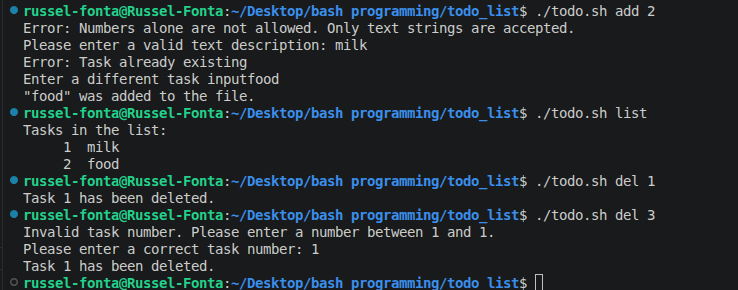

# terminal-To-do-list-application
this project help facilate data addition to list delection and provide data in the list to user.

## problem statement

solve the problem of data storage by the user

## 🎯 Project Goals

- facilitate the management of data by the user

## 🛠 Tech Stack

**LANGUAGE**
- Bash

**OTHER TOOLS**
- GitHub

## 🖥 Features

- storage of data entered by the user
- providde a list for all task or data stored
- permits delection of data if required
- permit addiction of data to the list

## 📷 Screenshot



## ⚙ Installation & Setup

Clone the repository:

```bash
git clone https://github.com/fontawestbrook99-arch/Todo-list
cd To-do-list
chmod +x Todo.sh
./Todo.sh
📚 What I Learned
How correct and understand erros produced
Future Improvements
add color
provide more option for user 
👨🏽‍💻 Author
Name RUSSEL FONTA FADIL
Russel  Developer
📩 Email: fontawestbrook99@gmail.com
🌍 Based in Cameroon | Open to remote opportunities